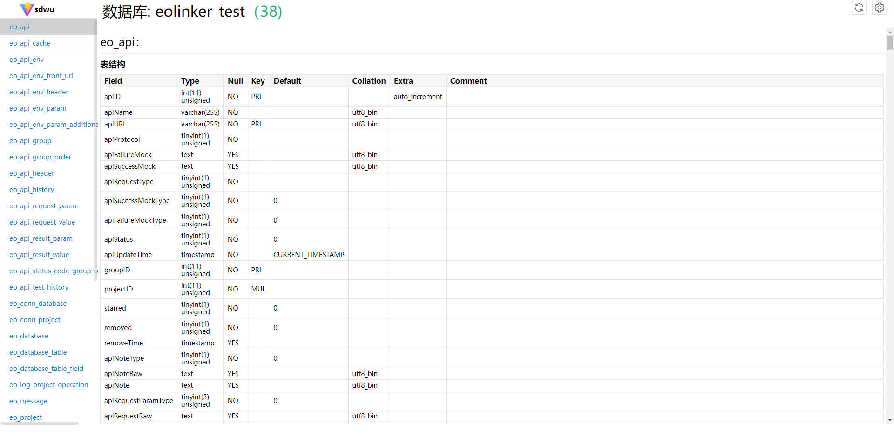

# sql-doc-web-ui
一款网页版查看sql doc的小工具，练手项目

## 如何使用
### 帮助
```shell
sdwu --help
```
### 创建默认配置文件
```shell
sdwu config > config.yaml
```
修改config.yaml
```yaml
Host: "0.0.0.0"
Port: 7654
Mysql:
  Host: 127.0.0.1
  Port: 3306
  Username: root
  Password:
  DatabaseName: test
OpenBrowser: false
GenerateSqlFile: false
```

### 启动
```shell
sdwu start -f config.yaml
```

